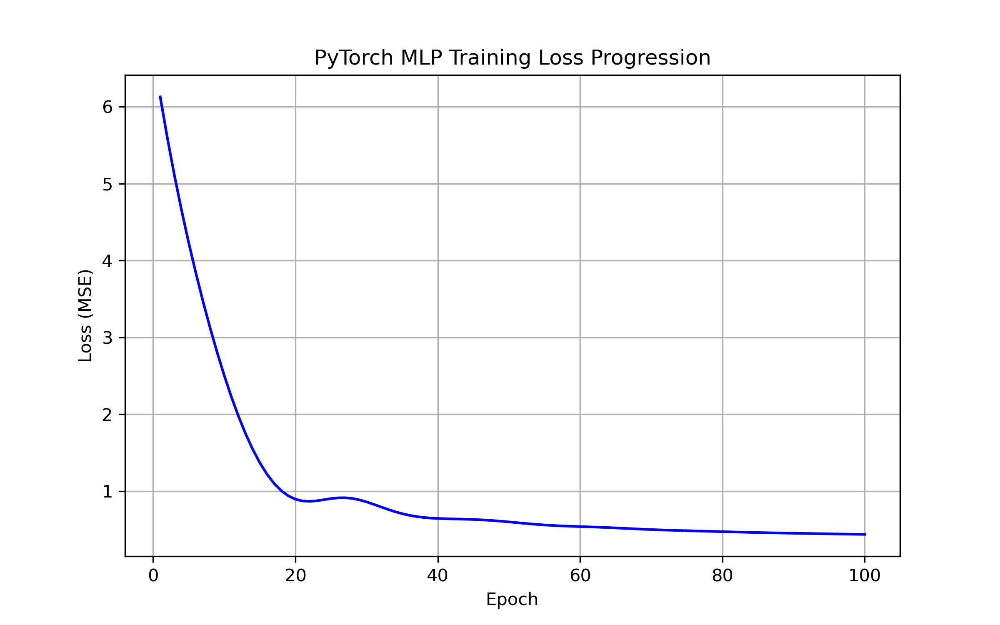

# Assignment 2: Single-Layer/Shallow Networks (Regression)

## Commands to Run

```bash
# Activate Conda environment
conda activate env_csci4425

# Execute main script from repository root
python assignment2/hw2.py
```

---

## Part 1: Data Exploration Summary

### Dataset Description (`DESCR`)
```text
California Housing dataset
--------------------------
Data Set Characteristics:
:Number of Instances: 20640
:Number of Attributes: 8 numeric, predictive attributes and the target
:Attribute Information:
    - MedInc        median income in block group
    - HouseAge      median house age in block group
    - AveRooms      average number of rooms per household
    - AveBedrms     average number of bedrooms per household
    - Population    block group population
    - AveOccup      average number of household members
    - Latitude      block group latitude
    - Longitude     block group longitude
:Missing Attribute Values: None

The target variable is the median house value for California districts, expressed in hundreds of thousands of dollars ($100,000).
```

### First 5 Rows (`df.head()`)
```text
   MedInc  HouseAge  AveRooms  AveBedrms  Population  AveOccup  Latitude  Longitude  MedHouseVal
0  8.3252      41.0  6.984127   1.023810       322.0  2.555556     37.88    -122.23        4.526
1  8.3014      21.0  6.238137   0.971880      2401.0  2.109842     37.86    -122.22        3.585
2  7.2574      52.0  8.288136   1.073446       496.0  2.802260     37.85    -122.24        3.521
3  5.6431      52.0  5.817352   1.073059       558.0  2.547945     37.85    -122.25        3.413
4  3.8462      52.0  6.281853   1.081081       565.0  2.181467     37.85    -122.25        3.422
```

### Dataset Summary Statistics (`df.describe()`)
```text
             MedInc      HouseAge      AveRooms     AveBedrms    Population      AveOccup      Latitude     Longitude   MedHouseVal
count  20640.000000  20640.000000  20640.000000  20640.000000  20640.000000  20640.000000  20640.000000  20640.000000  20640.000000
mean       3.870671     28.639486      5.429000      1.096675   1425.476744      3.070655     35.631861   -119.569704      2.068558
std        1.899822     12.585558      2.474173      0.473911   1132.462122     10.386050      2.135952      2.003532      1.153956
min        0.499900      1.000000      0.846154      0.333333      3.000000      0.692308     32.540000   -124.350000      0.149990
25%        2.563400     18.000000      4.440716      1.006079    787.000000      2.429741     33.930000   -121.800000      1.196000
50%        3.534800     29.000000      5.229129      1.048780   1166.000000      2.818116     34.260000   -118.490000      1.797000
75%        4.743250     37.000000      6.052381      1.099526   1725.000000      3.282261     37.710000   -118.010000      2.647250
max       15.000100     52.000000    141.909091     34.066667  35682.000000   1243.333333     41.950000   -114.310000      5.000010
```

---

## Part 4 & 5: Model Performance & Analysis

### Performance Comparison Table

| Model | MSE | RMSE |
| :--- | :--- | :--- |
| **Linear Regression** | 0.5290 | 0.7273 |
| **PyTorch MLP** | 0.4269 | 0.6534 |

### Analysis

1. **Model Comparison:** The PyTorch MLP model achieves a lower MSE (0.4269) and lower RMSE (0.6534) compared to Linear Regression (MSE: 0.5290, RMSE: 0.7273). Incorporating a non-linear ReLU activation function in the hidden layer allows the network to model non-linear interactions across features effectively.

2. **Loss Progression Plot:**



3. **Epoch Progression Discussion:** In early epochs, the loss drops rapidly as Adam optimizes initial weights. Past epoch 30, gradient updates stabilize and smoothly converge toward a steady minimum around epochs 80-100, demonstrating stable learning at a 0.01 learning rate.